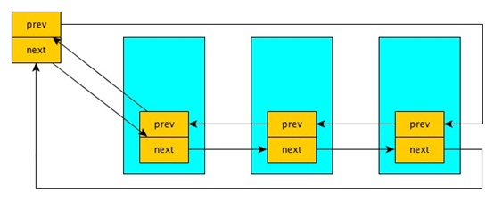

# 实验报告

课程名称：操作系统

实验类型：综合型

实验项目名称：同步互斥和Linux内核模块


## 一、实验环境

1、**PC端配置**：
处理器：Intel(R)Core(TM)i7-8550U CPU @ 1.80GHz
内存：8G
显卡：NVIDIA GeForce MX150

虚拟机配置（VMware workstation 15.5 pro）：
处理器内核数量：4
内存：4GB

2、**操作系统环境**：
Windows操作系统；

3、**Linux版本**：
Ubuntu 20.04


## 二、实验内容和结果以及分析

### 实验一:

#### 1、实验内容

有两条道路双向两个车道，即每条路每个方向只有一个车道，两条道路十字交叉。假设车辆只能向前直行，而不允许转弯和后退。如果有4辆车几乎同时到达这个十字路口，如图（a）所示；相互交叉地停下来，如图（b），此时4辆车都将不能继续向前，这是一个典型的死锁问题。从操作系统原理的资源分配观点，如果4辆车都想驶过十字路口，那么对资源的要求如下：

+ 向北行驶的车1需要象限a和b；
+ 向西行驶的车2需要象限b和c；
+ 向南行驶的车3需要象限c和d；
+ 向东行驶的车4需要象限d和a。


我们要实现十字路口交通的车辆同步问题，防止汽车在经过十字路口时产生死锁和饥饿。在我们的系统中，东西南北各个方向不断地有车辆经过十字路口（注意：不只有4辆），同一个方向的车辆依次排队通过十字路口。按照交通规则是右边车辆优先通行，如图(a)中，若只有car1、car2、car3，那么车辆通过十字路口的顺序是car3->car2->car1。车辆通行总的规则：

1. 来自同一个方向多个车辆到达十字路口时，车辆靠右行驶，依次顺序通过；
2. 有多个方向的车辆同时到达十字路口时，按照右边车辆优先通行规则，除非该车在十字路口等待时收到一个立即通行的信号；
3. 避免产生死锁；
4. 避免产生饥饿；
5. 任何一个线程（车辆）不得采用单点调度策略；
6. 由于使用AND型信号量机制会使线程（车辆）并发度降低且引起不公平（部分线程饥饿），本题不得使用AND型信号量机制，即在上图中车辆不能要求同时满足两个象限才能顺利通过，如南方车辆不能同时判断a和b是否有空。

#### 2、设计思路

分析题目要求，将每一辆骑车视作一个单独的线程，则一个线程所执行的任务如下：

1. 按照汽车方向加入个方向的等待队列；
2. 等待同方向的前方车辆离开等待队列；
3. 等待正在道路上行驶的同方向，以及左右方向的车辆离开道路（不需要等待对面方向的车辆离开道路，因为对面方向的车辆和本方向车辆并不占用相同的资源）；
4. 该车辆准备发车；
5. 检测死锁，如果四个方向都要同时发车，则触发死锁检测线程；
6. 遵循右侧车辆先行原则，让右侧车辆先行并等待；
7. 车辆发车，进入路口第一段，并从等待队列中弹出；
8. 车辆进入路口第二段；
9. 车辆彻底通过路口；

为了更加充分地体现整个程序进行时的并发过程，我对实验报告中的输出做了一些调整，车辆同行过程中，在不同阶段下会产生如下输出：

`"Car %d from %s arrives at crossing.\n",ID,dirS`表示车辆已经到达了等待队列的首部，也就是在路口等待的阶段；

`"Car %d from %s is going to get into the crossing.\n"`表示车辆已经从路口出发，离开等待队列；

`"Car %d from %s has gone through part X.\n",ID,dirS`表示车辆已经通过路口中的X部分，例如对于北方出发的车辆，首先会通过上方图中的part C的部分，则在通过part C后产生输出`Car 1 from south has gone through part c`,其次会通过part d，通过part d后产生输出`Car 1 from south has gone through part d`，产生这一输出后也就代表着车辆已经通过了路口；

#### 3、实现过程

上述线程所执行的9个任务中，涉及诸多互斥与同步的问题，均通过互斥锁，条件变量以及线程间的全局变量来实现，这里将对如何实现9个任务的同步与互斥进行说明：

在任务1和7中，涉及对于等待队列的修改，`mutex_wait[]`是四个方向的等待队列的互斥锁，在每次新的车辆入队或出队时，需要对相应的队列加锁来避免同时读写，以下是入队时的代码：

```c
pthread_mutex_lock(&mutex_wait[dir]);  //访问等待队列的互斥锁
enqueue(ID,Queue_wait[dir]);           //将本车辆加入等待队列中 
pthread_mutex_unlock(&mutex_wait[dir]);
```

任务2中需要等待同方向上前方的车辆离开队列，通过队列数据结构队头的ID即可判断前方是否还有车辆，如果不是自己则继续等待：

```c
while(front(Queue_wait[dir])!=ID);
```

任务3需要等待正在道路上行驶的三个方向的车辆（无需等待对面方向的车辆）通过进程间的全局变量`flag[]`来判断，`flag[]`代表每个方向上是否有车辆正在路口通行，当一辆车发动后（在任务7中），相应方向flag置1，一辆车行驶过路口时，相应方向flag置0（在任务9中），通过判断对应的flag是否为1即可知道该放下是否有车在通行；
```c
while(flag[dir]);
while(flag[(dir+1)%4]);
while(flag[(dir+3)%4]);  
```

无需担心`flag[]`的互斥问题，因为会修改flag的只有同一方向的线程（车辆），通过路口的车辆会在任务9中修改flag，而此时另一辆同方向的车辆还在任务3中等待，而另一次修改flag的机会在任务7中，因此不存在互斥访问问题。


任务4、5所做的均是为了避免死锁，进入任务4后，变量`crossSource`减少1，并同过相应的互斥锁避免`crossSource`的同时修改，`crossSource`是一个初值为4的变量，代表路口资源，每一辆车即将发车时`crossSource`减少1，通过路口后`crossSource`增加1，当`crossSource`为0时，代表4个方向同时要通车，意味着死锁发生，因此需要触发死锁进程：

```c
pthread_mutex_lock(&mutex_cross);
crossSource--;    //道路资源统计量减一
pthread_mutex_unlock(&mutex_cross);
if(!crossSource)  //四个方向都要占用资源，发生死锁
{
    printf("DEADLOCK: car jam detected, signalling North to go.\n");
    pthread_mutex_lock(&mutext_deadLock); 
    pthread_cond_signal(&cond_deadLcok);  //触发死锁进程
    pthread_mutex_unlock(&mutext_deadLock);
}
```

死锁进程的内容是如下一段代码：

```c
while(1)
{
    pthread_mutex_lock(&mutex_cross);
    //等待唤醒
    pthread_cond_wait(&cond_deadLcok,&mutex_cross);
    //唤醒后，首先让北方车辆通信，利用条件变量激活北方的车辆
    pthread_mutex_lock(&mutex_dir[NORTH]);
    pthread_cond_signal(&cond_first[NORTH]);
    pthread_mutex_unlock(&mutex_dir[NORTH]);
    pthread_mutex_unlock(&mutex_cross);
}
```

死锁进程创立后一直通过信号量等待车辆线程去唤醒，一旦检测到死锁后唤醒，死锁进程将优先令北方车辆通过，从而解决死锁问题。

任务6通过条件变量完成：如果右方有车辆通行则令右侧车辆先行，同时为了避免饥饿问题，通过条件变量等待右侧车辆行驶过后，右侧车辆唤醒左侧车辆通行

```c
if(Queue_wait[(dir+1)%4]->size!=0)
{
    pthread_cond_wait(&cond_first[dir],&mutex_dir[dir]);
}
```

发车后，每一个方向的车辆根据自己所需的资源不同，执行不同的代码，通过互斥锁去访问abcd四种资源，并在通过相应位置后发送对应的信息，任务7-9就执行这一段内容，以北方车辆为例，代码如下:

```c
flag[dir]=1;                     //本方向有车辆正在通信的信号

if(dir==NORTH)
{
//进入第一段路
pthread_mutex_lock(&mutex_c);
pthread_mutex_lock(&mutex_wait[dir]);
//这一段话表示车辆已经进入路口
printf("Car %d from %s is going to get into the crossing.\n",ID,dirS);
//车辆从等待队列中弹出
dequeue(Queue_wait[dir]);
pthread_mutex_unlock(&mutex_wait[dir]);

usleep(500);  //过一段路时间0.5ms
//这一段话表示车辆已经通过第一段路
printf("Car %d from %s has gone through part c.\n",ID,dirS);
pthread_mutex_unlock(&mutex_c);

//第一段路走完，进入第二段路
pthread_mutex_lock(&mutex_d);
usleep(500);  //过一段路时间0.5ms
//这一段话表示车辆已经通过第二段路
printf("Car %d from %s has gone through part d.\n",ID,dirS);
pthread_mutex_unlock(&mutex_d);

crossSource++;  //通过路口，释放资源

}
```

#### 4、实验结果以及分析：
(这部分的截图来自于VScode上的WSL环境)


由于为了体现出整个过程的并发，我修改了输出的内容（在前文已经说明过），这里对结果稍作分析：

以下图结合输出来进行说明：


1. 首先南方车辆1先进入队列，由于前方无车辆，因此进入路口；

2. 随后，北方，东方均有车辆到达(2与3)，北方车辆由于可以和南方车辆一同在路口行驶，故北方车辆也发动：`Car 2 from North is going to get into the crossing.`

3. 接下来西、南、北均有新的车辆到达路口（4，5，6）；

4. 正在路口行驶的两辆车（1与2）通过a,c,b,d区域，产生输出，注意这过程是并发进行的；

5. 此时注意到有四辆车在路口等待，产生了死锁，故触发死锁线程，产生输出`DEADLOCK: car jam detected, signalling North to go.`

6. 来自北方的车辆6先通行，通行结束后，东方车辆再次通行（3），此时必然是东方车辆通行，由于右侧车辆优先，西方车辆等待南方，南方等待东方；

7. 就在3号车辆刚离开时，一辆新的东方车辆来到东方等待队列头（7）

8. 东方车辆行驶结束后，南方车辆再次行驶（5），南方车辆行驶结束后，路口仅剩下西方与东方车辆（7与4）

9. 显然这两辆车辆可以并发行驶（对面方向的车辆），故两辆车同时在路口中行驶

10. 东方的最后一辆车（8）到达，在7与4行驶结束后，8再次行驶通过路口。

通过上述分析，我们可以看出，整个程序遵照了我们上述的所有原则，并且尽可能以最大并发的方式来运行，说明程序功能正常。

源程序将在附录中给出。


### 实验二:

#### 1、实验内容：

编写一个Linux的内核模块，其功能是遍历操作系统所有进程。该内核模块输出系统中每个进程的：名字、进程pid、进程的状态、父进程的名字等；以及统计系统中进程个数，包括统计系统中TASK_RUNNING、TASK_INTERRUPTIBLE、TASK_UNINTERRUPTIBLE、TASK_ZOMBIE、TASK_STOPPED等（还有其他状态）状态进程的个数。同时还需要编写一个用户态下执行的程序，格式化输出（显示）内核模块输出的内容。

#### 2、设计思路以及实现过程

**（这一实验内容较为简短，故实现过程和思路在一起表述）**

为了完成实验内容，需要了解遍历进程的方式，以及有关进程的`task-struct`结构。

`list_head`是一个双向链表的结构体，通过这个双向链表我们可以获取到所有的进程；

通过`list_for_each（list_head *pos，list head *head）`可以遍历所有线程，head代表着表头，pos则是循环变量（也就是每次循环中pos的值会移向下一个），遍历到重新回到表头时；

初始化时，*head需要是进程链表的表头，在这里，我们将其初始化位0号进程`init_tast`;

虽然`list_for_each`能够帮助我们找到进程对应的`list_head`，但`list_head`组成的链表并没有数据域，它是作为`task-struct`结构的一个成员存在的，因此需要根据对应的`list_head`地址获取相应的`task-struct`结构的地址，这就需要用到函数`list_entry(ptr, type, member)`；

其中，ptr代表我们找到的指针，也就是list_head，type是父结构的类型，在这里就是struct tast_list结构，member代表ptr作为type的一个什么成员，这里是tasks（list_head是tast_list的tasks成员）

代码例子如下：
```c
struct task_struct *  p = list_entry(pos, struct task_struct, tasks);
```

通过上述方式我们就可以遍历所有的进程，其次就是根据`task_struct`结构，来获取并统计进程的相关信息，本次lab所需要用到内容如下：
```c
pid_t pid;                 //进程标识符
char comm[TASK_COMM_LEN];  //进程名称
volatile long state;       //进程状态
int exit_state;            //进程退出状态
struct task_struct __rcu *parent;   //当前进程的父进程
```

其中，进程状态`state`以及退出状态`exit_state`的可能取值如下：
```c
 /*
  * Task state bitmask. NOTE! These bits are also
  * encoded in fs/proc/array.c: get_task_state().
  *
  * We have two separate sets of flags: task->state
  * is about runnability, while task->exit_state are
  * about the task exiting. Confusing, but this way
  * modifying one set can't modify the other one by
  * mistake.
  */
 #define TASK_RUNNING            0
 #define TASK_INTERRUPTIBLE      1
 #define TASK_UNINTERRUPTIBLE    2
 #define __TASK_STOPPED          4
 #define __TASK_TRACED           8

/* in tsk->exit_state */
 #define EXIT_DEAD               16
 #define EXIT_ZOMBIE             32
 #define EXIT_TRACE              (EXIT_ZOMBIE | EXIT_DEAD)
```

通过上述内容，我们已经能够通过遍历以及查看`task_struct`结构的对应成员来获取进程的相关信息。

为了能够通过用户态程序来查找到自定义的内核模块的输出，故对于内核模块的输出中加一些标识符来标记：

输出开始时通过#$#作为开始的标记
```c
printk("#$# Process counter begin:\n");   //输出开始,#$#作为开始标记
```

其中每一段输出中以@作为标记,例如：
```c
printk("@id: %d\n",cur_process->pid);
```

结束输出时以#*#作为标记
```c
printk("#*#Process counter ends\n");  //输出结束，*#*作为结束标记
```

而用户态的程序，只需要在内核模块输出的日志文件中，找到带有上述标记的部分并输出即可，上述代码将在附录中给出；

#### 3、实验结果截图

实验二的实验结果较为简单，只需要执行并查看效果即可,输出内容较长，故只展示开头与结尾：

通过用户态程序read.c获取内核模块中的对应输出


## 三、讨论、心得

实验1中，由于涉及较多的互斥同步问题，每一个控制互斥和同步的锁以及变量的修改位置十分重要，否则将导致潜在的死锁；

回顾一下本人设计的每个线程按顺序执行的9个任务：

1. 按照汽车方向加入个方向的等待队列；
2. 等待同方向的前方车辆离开等待队列；
3. 等待正在道路上行驶的同方向，以及左右方向的车辆离开道路（不需要等待对面方向的车辆离开道路，因为对面方向的车辆和本方向车辆并不占用相同的资源）；
4. 该车辆准备发车；
5. 检测死锁，如果四个方向都要同时发车，则触发死锁检测线程；
6. 遵循右侧车辆先行原则，让右侧车辆先行并等待；
7. 车辆发车，进入路口第一段，并从等待队列中弹出；
8. 车辆进入路口第二段；
9. 车辆彻底通过路口；

在上述设计思路的讲述中，本人提到过通过`flag[]`这一全局变量来表示每一个方向上是否有车辆正在路口行驶，这一变量的修改时间较为关键，在程序设计之初，`flag[dir]=1`写在任务4的位置上，因为车辆即将出发，所以可以看作正在行驶中。

但是这样的设计导致了死锁问题，注意到在任务6中这一车辆可能因为右方有车正在行驶而等待
```c
if(Queue_wait[(dir+1)%4]->size!=0)
{
    pthread_cond_wait(&cond_first[dir],&mutex_dir[dir]);   //等待右侧车辆（或死锁进程）向自己发送可以通行的信号，避免饥饿
}
```

但是在程序的设计中，如果道路中有车辆正在行驶，除非是对面车辆，否则需要等待，那么在这种情况下，右侧车辆因为其左侧方向的`flag`为1而等待，而左侧车辆又在等待右侧车辆通信，造成了死锁。

```c
while(flag[dir]);                 //若本方向上有车正在通行，则等待
while(flag[(dir+1)%4]);           //若右侧有车正在通行，则等待
while(flag[(dir+3)%4]);           //若左侧有车正在通行，也需要等待（虽然右侧车优先级高于左侧车，但是不应当抢占）
```

解决这一问题的方式，在于将`flag`修改的时间点改到任务7的位置，确保右侧车辆通过后，再将`flag`置为1;

除此之外，`flag`归0的时间也很关键，在任务9中存在如下指令需要完成：

1. `flag`归0,表示这个方向上的车辆已经通过；
2. 向左侧车辆发送信号，示意其可以通信；
3. 解除这一方向上的互斥锁；

三个指令的顺序很关键，否则会导致潜在的死锁；在程序设计初期，上述指令按照213的顺序来实现：代码如下：

```c
//发出信号令左侧的车辆通行 
pthread_mutex_lock(&mutex_dir[(dir+3)%4]);
pthread_cond_signal(&cond_first[(dir+3)%4]);
pthread_mutex_unlock(&mutex_dir[(dir+3)%4]);

flag[dir]=0;

pthread_mutex_unlock(&mutex_dir[dir]);  //当前方向解锁
```

条件变量需要结合互斥锁使用，考虑前三行代码执行时可能遇到如下情况：

南方的车辆已经通过路口，此时需要给西方车辆发送信号，示意其可以离开（通过`pthread_cond_signal`）;

但此时西方车辆正在等待南方车辆行驶过路口（此时flag依然为1）：
```c
while(flag[dir]);                 //若本方向上有车正在通行，则等待
while(flag[(dir+1)%4]);           //若右侧有车正在通行，则等待
while(flag[(dir+3)%4]);           //若左侧有车正在通行，也需要等待（虽然右侧车优先级高于左侧车，但是不应当抢占）
```

西方车辆尚未通过`pthread_cond_wait`发生阻塞，因为`pthread_cond_wait`的阻塞将时期释放相应的互斥锁，但这里，因为`while`循环发生的阻塞，`mutex_dir`尚未释放，故南方车辆无法向北方车辆发送信号，导致了死锁。

解决的方式，在于通过将`flag[dir]=0;`这一指令放置在`pthread_cond_signal`之前，从而能够使左侧的车辆不被`while`所阻塞，从而在`pthread_cond_wait`处阻塞，并释放`mutex_dir`互斥锁，这一段代码可以正常运行。

在进行本次实验前，单纯阅读条件变量的相关资料，还是无法对条件变量有较为深入的理解，例如为什么条件变量的阻塞需要释放一个对应的互斥锁。但是在本次实验的实现过程中，因为遇到了各种死锁的情况，因此深刻体会到条件变量的作用以及其便捷性。

同时也可以感受到，对于并发度越高的问题，其同步与互斥的问题就越为复杂，如果在本程序中，完全放弃路口的并行（即路口只能同时有一辆车辆行驶），程序将更加简单，而在本人的程序中，可以允许对面方向同时通车（即南北，东西方向）则需要进一步的互斥同步机制来保证并发的正常进行。

多线程的编程相比一般的程序，需要更加注重逻辑上的问题，尤其在同步互斥上面需要非常注意顺序的影响。

实验二本身较为简单，其主要的学习重点在于理解Linux中遍历线程的方式，以及`task-struct`的结构。

实验中遇到的一个稍微不易理解的点在于`list_entry`的含义，为什么当我已经获取到进程的list_head时，还需要使用这一函数才能获取到进程的相应信息？

`list_head`所够称的双向链表的结构如下：



注意到在这一链表中，是没有数据域的，那么我们无法从这个链表中获取更多的额外信息；

经过查阅资料，得知`list_head`实际上是作为`task-struct`结构中的子成员，其主要目的，在于通过`list_head`去找到对应的`task-struct`结构。

`list_entry`的字面含义有些难以直接理解，但是查看Linux中的list.h的宏，可以注意到，`list_entry`有可以称为`container_of`,这一理解更加直观，也就是我们需要找到“contain”了这个`list_head`成员的结构体。

```c
#define list_entry(ptr, type, member) /
    container_of(ptr, type, member)

#define container_of(ptr, type, member)                 /
({                                                        /
    const typeof( ((type *)0)->member ) *__mptr = (ptr);/
    (type *)( (char *)__mptr - offsetof(type,member) ); /
})

```
如此以来就很容易理解`list_entry`的功能，以及其参数的含义。


#### 


#### 
